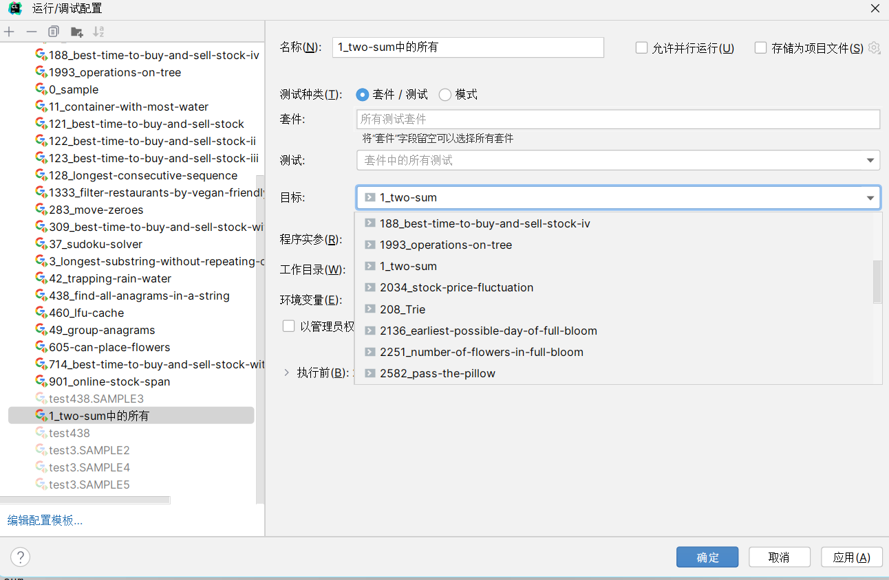
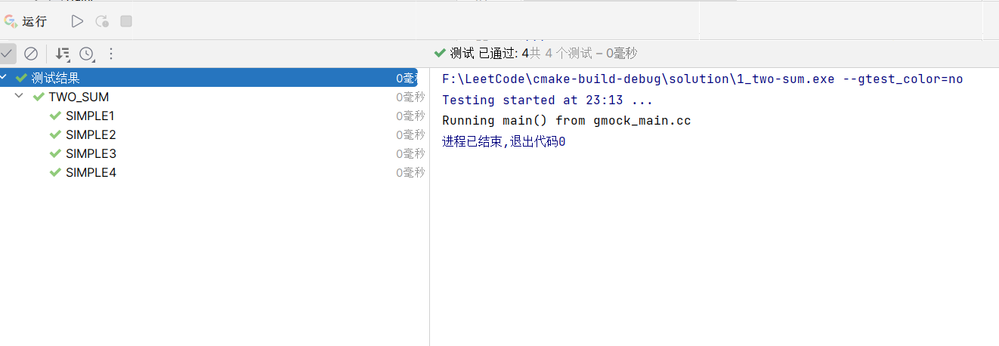
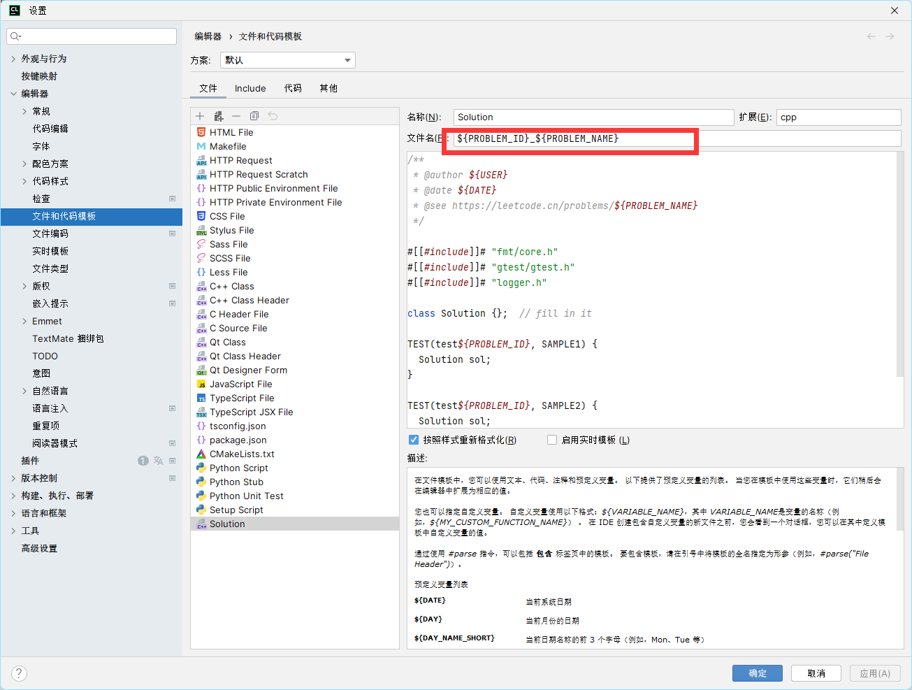
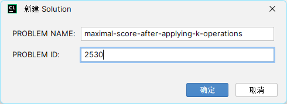

## 快速使用

CMake为[solution](.)目录下的每一个`*.cpp`文件生成一个同名目标（无后缀）。

删除[solution](.)下除了[CMakeLists.txt](./CMakeLists.txt) 和 [0_sample.cpp](./0_sample.cpp)的所有文件。

通过复制[0_sample.cpp](/0_sample.cpp)到[solution](.)下的任意位置（包括子目录）并重命名cpp源文件，测试用例。

## 测试说明

使用GTest框架对代码进行测试。并集成fmt等工具。

例如，对于第一题[1_two-sum.cpp](./top100/1_two-sum.cpp), 在写好测试用例后。

### 从命令行上手

从项目根目录开始

```shell
mkdir "build"
cd build
cmake .. -DCMAKE_BUILD_TYPE=Debug "-DCMAKE_MAKE_PROGRAM=D:\MinGW\bin\make.exe" -G"MinGW Makefiles" 
make 1_two-sum
.\solution\1_two-sum.exe
```

其中，将`"-DCMAKE_MAKE_PROGRAM=D:\MinGW\bin\make.exe" -G"MinGW Makefiles"` 中的路径和生成器名字替换为你自己的。

如果在Linux系统中安装了工具链，应该可以不用添加参数

```shell
mkdir build
cd build
cmake ..
./solution/1_two-sum
```

输出结果

```shell
anti@AntiO2:~/projects/LeetCode/build$ ./solution/1_two-sum
Running main() from gmock_main.cc
[==========] Running 4 tests from 1 test suite.
[----------] Global test environment set-up.
[----------] 4 tests from TWO_SUM
[ RUN      ] TWO_SUM.SIMPLE1
[       OK ] TWO_SUM.SIMPLE1 (0 ms)
[ RUN      ] TWO_SUM.SIMPLE2
[       OK ] TWO_SUM.SIMPLE2 (0 ms)
[ RUN      ] TWO_SUM.SIMPLE3
[       OK ] TWO_SUM.SIMPLE3 (0 ms)
[ RUN      ] TWO_SUM.SIMPLE4
[       OK ] TWO_SUM.SIMPLE4 (0 ms)
[----------] 4 tests from TWO_SUM (0 ms total)

[----------] Global test environment tear-down
[==========] 4 tests from 1 test suite ran. (0 ms total)
[  PASSED  ] 4 tests.
```

对于力扣的题来说，`EXPECT_EQ(value_1, value_2)`这一个宏应该就够用了。

### CLion

#### 添加文件后先重新加载CMake项目

在运行配置中添加GTest, 目标中选择对应名字的目标。运行即可。




#### 在设置中添加模板



```c++
/**
 * @author ${USER}
 * @date ${DATE}
 * @see https://leetcode.cn/problems/${PROBLEM_NAME}
 */
 
#[[#include]]# "fmt/core.h"
#[[#include]]# "gtest/gtest.h"
#[[#include]]# "logger.h"

class Solution {};  // fill in it

TEST(test${PROBLEM_ID}, SAMPLE1) {
  Solution sol;
}

TEST(test${PROBLEM_ID}, SAMPLE2) {
  Solution sol;
}
```

然后在创建文件中选择新创建的模板，输入题目编号和题目url中的名字，即可创建源文件。


